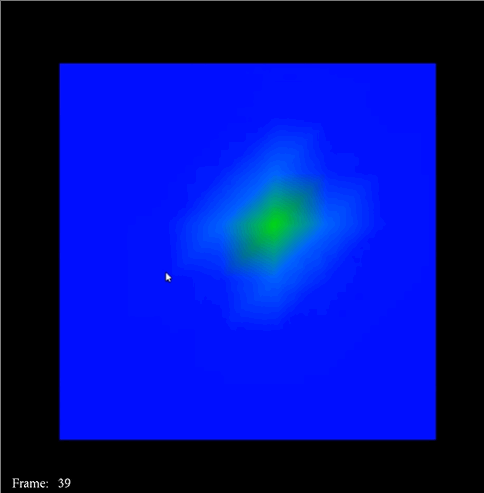

# 2D Heat Transfer Simulation Using Parallel Programming

CS467 - Oregon State University

Yuxing Deng

Joanna Getek

Brenda Huppenthal

Matthew Immerman

8/16/2023

## Introduction ##

Parallel programming is a method of computing that involves breaking down large
problems into subproblems, which are then computed simultaneously. In our project, we
explored the parallel programming APIs Open Multi-Processing (OpenMP) and Message
Passing Interface (MPI) by implementing a heat diffusion simulation in order to investigate how
best to improve the simulation performance in both contexts.
The simulation we implemented models how heat diffuses within a given material over
time. By dividing the solid into some finite number of elements, and using the heat diffusion formula,
then knowing the initial temperature for each element allows for the calculation of
the temperature at subsequent time steps using the current temperature of all surrounding
elements. This problem exhibits data parallelism, as the same equation is used for all elements,
and provides an interesting basis for exploration of how best to exploit the parallel programming
tools provided by OpenMP and MPI.

In both contexts, the task of calculating new temperatures for each element must be
divided between threads or processors, which we refer to as the partitioning scheme. All
elements that have neighboring elements assigned to a different thread or processor require
that the temperatures are shared between them at the end of each time step. These constraints
require effective data sharing and coordination schemes between the threads and processors.
Additionally, the constraint that boundary elements must be shared motivates our interest in the
compute to communicate ratio. This is the ratio of the number of elements that each processor
computes versus the number of elements that the processor must communicate to neighboring
processors.

In OpenMP, as multiple threads within a process are able to access the shared global
memory, the simulation performance is dependent on thread synchronization, the compute to
communicate ratio, and effective cache utilization. Since the overhead for communication
between threads is relatively small, we anticipated that the cache utilization methods would
more significantly impact simulation performance. Determining the “sweet spot” for the compute
to communicate ratio is challenging without running experiments. We varied the number of
threads and utilized different memory storage and partitioning schemes to identify the “sweet
spot” where the maximum calculations are performed in parallel while minimizing
communication time through thread synchronization.

In MPI, because the data is distributed across multiple computers, there is no shared
global memory. Therefore, the boundary element temperatures must be transmitted across a
network during computations, resulting in significant overhead. The partitioning strategy can
impact communication efficiency, where more efficient data sharing leads to reduced
communication, allowing for more time dedicated to computation. This is explored in our project
through the use of horizontal, vertical and rectangular partitions. Additionally, the communication
method determines the frequency of creating sending and receiving functions between
processors. We examined two communication methods: sending data one row at a time which
increases the frequency of communication between processors, versus sending the entire
partition (“strip”) which transmits more data through the network in a single instance. We
anticipated that methods with minimal communication would have the greatest impact on the
compute to communicate ratio when using MPI.

Graphical representation of our 2D heat diffusion simulation created by Professor Bailey: 

## Research Goals ##
Our research objective was to implement a 2D heat simulation in OpenMP and MPI
analyzing the performance of the simulation. In particular, we investigated how differences in the
implementation of computational and communication methods influenced the compute to
communicate ratio in the 2D simulation.
Our group had the following specific goals which involved analyzing the factors that would most
likely influence the simulation performance and compute to communicate ratio:
1. Investigate the impact of workload distribution for each thread or processor

  ● Varying the number of elements, threads, and processors which altered the
amount of elements each unit was responsible for computing.

2. Examine the role of partitioning strategies (horizontal, vertical and rectangular)

  ● In the 2D array, there were many different ways to split up the data between each
thread or processor. Different partition methods altered how boundary elements
were shared among processing units, the amount of elements transmitted and
affected the storage of values in memory.

3. Evaluate the impact of cache storage

  ● For the 2D OpenMP heat simulation with vertical partitions, the two methods of
traversal, row-major and column-major order, were explored to analyze the effect
of cache storage on the computation time.

4. Analyze the data distribution and gathering methods (row by row vs. strip by strip)

  ● In the 2D MPI heat simulation with horizontal partitions, two different data
exchange approaches were explored to analyze the effect the amount of
communication created within the network had on performance

## Experimental Results ##

  

  

  

  

  

### OpenMP Graphs - Discussion ###
Figure 5 depicts the peak performance measured from the 2D heat simulation using 32
threads with OpenMP. As expected, the most optimal performance was observed when utilizing
horizontal partitions. With horizontal partitions, many of the values within the arrays are
arranged contiguously in memory. The spatial coherence allows for more cache hits when
accessing memory, enabling the program to allocate more time to calculations and less time to
fetching elements from memory. Additionally, this arrangement generates optimal temporal
coherence, as the elements needed for computations are more likely to be already stored in the
cache and ready for use.
The least performant scheme was the vertical column-traversal partition, as anticipated,
as this scheme results in the least spatial and temporal coherency. The values stored in this
partition were less likely to be contiguous and accessing neighboring elements down a column
generated more cache misses, significantly affecting performance.
The peak performance for all partitions was observed with 32 threads when using
average to large dataset sizes. Notably, the performance at 36 and 40 threads was significantly
worse, despite distributing computations across more threads. One possible explanation is that
the rabbit server consists of 32 CPUs, which leads to more significant costs when using more
than 32 threads, as each thread is no longer assigned to a single core. With the larger number
of threads, the program requires scheduling multiple threads per CPU, requiring more time to be
spent on thread synchronization resulting in a less favorable compute to communicate ratio.

  

### MPI Graphs - Discussion ###
Figure 10 depicts the peak performance achieved during the heat simulation using 16
processors with MPI. In contrast to OpenMP, MPI is more significantly affected by the
compute-to-communicate ratio of elements assigned to each processor.
The most optimal performance was attained when using rectangular partitions. A
possible explanation for this phenomenon lies in the superior compute-to-communicate ratio
facilitated by this partition scheme (SIDE / (I + J) : 2 versus SIDE / N : 2 ratio of the strip
partitions, where SIDE is the number of elements along one side, I and J are the number of
rows and columns assigned to each partition).
Horizontal and vertical partitioning strategies exhibited similar performance, with these
two partitioning schemes demonstrating an equivalent compute-to-communicate ratio when
subjected to the same number of elements and processors. This further underscores the
influence of the compute-to-communicate ratio upon the efficacy of MPI-based partitioning
schemes.
Within the context of horizontal partitions, our results demonstrated that the strip-by-strip
method outperformed the row-by-row approach when dealing with large data size. This
observed performance enhancement can be linked to the reduced communication overhead
during distribution and gathering data in the strip-by-strip approach.
Among all the partitioning schemes, under a fixed number of elements, increasing the
number of processors does not lead to performance improvement for small data sizes; it either
remains unchanged or quickly reaches a plateau. However, when dealing with larger data sizes,
increasing the processor count results in an almost linear speedup.
When utilizing batch scripts to compile and execute our programs, we can utilize a
maximum of 16 processors from the MPI cluster. Notably, in the context of larger data sizes,
performance continues to improve when utilizing 16 processors. Exploring the performance
variation with an increased number of processors would be intriguing, as it has the potential to
uncover the "sweet spot" in the compute-to-communicate ratio.

